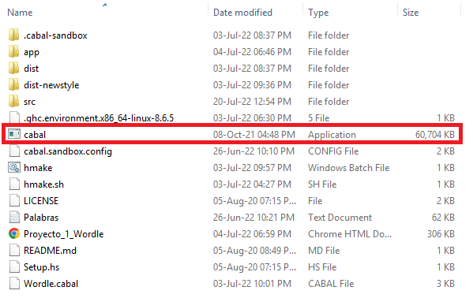

## WORDLE

Este proyecto implementa el juego Wordle en el lenguaje de programación Haskell.
Cuenta con dos modos de juego: Modo mente maestra y modo descifrador.

### Modo mente maestra 
En este modo el jugador debe adivinar una palabra seleccionada por la computadora. El usuario debe introducir una palabra de 5 letras en mayúsculas y la computadora verificará cada una de las letras de dicha palabra. Si están en la posición correcta, son toros, si no están en la posición correcta pero forman parte de la palabra son vacas y si no están en la palabra son -.
El jugador tiene 6 oportunidades para adivinar la palabra correcta, sino se termina el juego.

### Modo descifrador
En este modo el jugador debe pensar una palabra de 5 letras y la computadora adivinará dicha palabra. La computadora dará opciones de palabras y es el jugador quien debe indicar cuales son toros, vacas y -. En caso de no adivinar la palabra, el jugador gana, pero si la computadora adivina la palabra o el jugador hace trampa, el jugador pierde.

### ¿Cómo jugar Wordle?
El juego puede iniciarse con una llamada en consola, introduciendo el modo de juego como un argumento. Para la corrida de este juego, se requiere de Cabal. Las descargas de Cabal pueden encontrarse en: https://www.haskell.org/cabal/download.html. Para Windows es recomendable el archivo .exe, el cual puede incluirse directamente en la carpeta de este proyecto.

Una vez descargado Cabal realizar el siguiente comando desde una consola abierta en el directorio en el que se han guardado el proyecto y el archivo exe de Cabal:
    
        cabal update
        
 Que descargará la versión más reciente de Cabal y permitirá correr el juego.

#### Para Windows 
Se debe correr el archivo hmake.bat desde la consola abierta en el directorio del proyecto que crea un archivo ejecutable Wordle.exe. El archivo bat puede abrirse desde la consola como:

    .\hmake.bat

Luego en el mismo directorio de Wordle.exe se debe correr el archivo con el modo deseado:

    .\Wordle.exe descifrador
    .\Wordle.exe mentemaestra

#### Para Linux
Se debe correr el archivo hmake.sh que crea un archivo ejecutable. Y luego se debe ejecutar este archivo llamado Wordle que genera.

##### El informe del proyecto se encuentra en el archivo Proyecto_1_Wordle.pdf de este repositorio.
